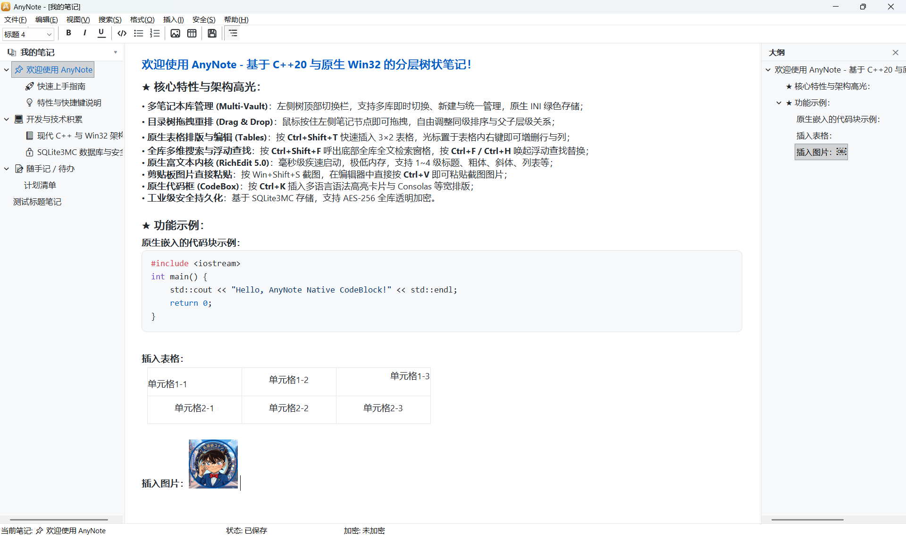

# AnyNote

<p align="center">
  <strong>基于 C++20 与原生 Win32 的极速分层树状桌面笔记</strong>
</p>

<p align="center">
  
  
  
  
  
</p>

---

## 📖 项目简介

**AnyNote** 是一款面向 Windows 平台的原生轻量级桌面笔记应用。它告别了现代桌面软件普遍采用的庞大 Webview/Electron 框架，坚持以 **现代 C++20**、**Win32 API**、**RichEdit 5.0**、**GDI+** 与 **SQLite3MC** 构建。

AnyNote 拥有毫秒级极速冷启动、极低的内存占用（通常仅十几兆）和丝滑的系统原生响应体验，同时集成了树形目录管理、原生富文本编辑、语法高亮代码块、结构化表格、大纲导航、多笔记本库切换与工业级 AES-256 全库透明加密。

---

## 🖼️ 界面预览



*图：一屏尽揽分层树状目录、多笔记本库管理、代码块高亮、原生表格、实时大纲面板与置顶功能。*

---

## ✨ 核心特性

### 🌲 分层树状目录与多笔记本库 (Multi-Vault)
- **无限层级结构**：使用直观的树状目录组织个人知识体系，支持新建笔记、子笔记与就地重命名。
- **拖拽自由重排 (Drag & Drop)**：鼠标拖拽即可调整节点排序或父子层级关系。
- **多库即时切换**：顶部下拉框支持工作、学习、私人等多个笔记本库独立隔离与快速切换，配置以原生 INI 绿色存储。
- **节点快速过滤 (`Ctrl+P`)**：提供左侧目录树即时过滤搜索框，快速定位目录节点。

### 📝 极速原生富文本内核 (RichEdit 5.0)
- **毫秒启动与低开销**：基于 Windows 原生 `MSFTEDIT.DLL` 内核，极低资源占用。
- **丰富文本样式**：支持正文与 1~4 级标题（`Ctrl+0` ~ `Ctrl+4`）、粗体、斜体、下划线、删除线、项目符号列表、编号列表及文本高亮标记（`Ctrl+M`）。
- **原生剪贴板图片粘贴**：使用 `Win+Shift+S` 截图后，在编辑区直接 `Ctrl+V` 即可完成图片插入与嵌入排版。

### 💻 原生代码块与语法高亮 (CodeBox)
- **独立等宽卡片**：按 `Ctrl+K` 插入代码块，采用 Consolas 专属等宽字体与圆角底色卡片渲染。
- **多语言语法高亮**：支持 C++、Python、JavaScript、SQL 等常用语言的语法色彩高亮。
- **悬浮智能工具栏**：鼠标悬停在代码块上自动弹出悬浮栏，支持一键复制代码、切换语法高亮语言或删除代码卡片。

### 📊 原生表格排版与编辑 (Tables)
- **结构化排版**：按 `Ctrl+Shift+T` 快速插入 3×2 原生表格。
- **丰富右键菜单操作**：在表格单元格内右键即可便捷执行在上方/下方增删行、在左侧/右侧增删列，支持单元格/整行/整列/全表格的水平与垂直对齐调整。

### 📑 实时目录大纲面板 (Outline)
- **标题自动感知**：右侧大纲视图（`Ctrl+Shift+O`）自动捕捉当前笔记中的多级标题，实时生成层次分明的结构树。
- **平滑双向导航**：长文档中点击大纲节点可立即定位跳转至对应段落，排版阅读一目了然。

### 🔍 多维全局检索体系
- **单篇查找与替换**：`Ctrl+F` / `Ctrl+H` 唤出原生浮动对话框，支持向前/向后精确查找与批量替换。
- **全库全文搜索 (`Ctrl+Shift+F`)**：底部停靠式搜索面板，毫秒级跨笔记检索全文匹配内容并快速跳转。

### 🔐 工业级安全持久化
- **SQLite3MC 驱动**：底层数据采用 SQLite3MC (Multiple Ciphers) 强加密引擎持久化存储。
- **AES-256 全库透明加密**：支持为笔记本设置主密码，全库采用 AES-256 算法透明加解密，保护个人隐私与核心资产；随时可修改或解除密码。

### 🪟 贴心系统原生交互
- **窗口一键置顶**：右上角图钉按钮或 `Help -> 窗口置顶`，方便在查阅资料或编码时悬浮记笔记。
- **高 DPI 适配**：全面适配 Windows Per-Monitor V2 高 DPI 缩放，多显示器拖拽切换文字清晰锐利。
- **绿色单一文件**：MSVC `/MT` 纯静态编译，生成零外部依赖的单一便携式可执行文件。

---

## ⌨️ 常用快捷键

| 操作分类 | 快捷键 | 功能说明 |
| :--- | :--- | :--- |
| **笔记管理** | `Ctrl + N` | 新建同级笔记 |
| | `Ctrl + Shift + N` | 新建子笔记 |
| | `F2` | 重命名当前笔记 |
| | `Ctrl + S` | 保存当前笔记 |
| | `Ctrl + P` | 快速聚焦目录树节点搜索框 |
| **文本与样式** | `Ctrl + 0` | 正文段落 |
| | `Ctrl + 1` ~ `4` | 切换 1 ~ 4 级标题 |
| | `Ctrl + B` / `I` / `U` | 粗体 / 斜体 / 下划线 |
| | `Ctrl + M` | 文本高亮标记 (Mark) |
| | `Ctrl + Z` / `Ctrl + Y` | 撤销 / 重做 |
| **内容插入** | `Ctrl + K` | 插入代码块 (CodeBox) |
| | `Ctrl + Shift + T` | 插入 3×2 表格 |
| | `Ctrl + V` | 粘贴剪贴板文本或直接粘贴截图图片 |
| **检索与导航** | `Ctrl + F` / `Ctrl + H` | 打开查找 / 替换浮动窗 |
| | `F3` / `Shift + F3` | 查找下一个 / 查找上一个 |
| | `Ctrl + Shift + F` | 呼出底部全库全文检索面板 |
| | `Ctrl + Shift + O` | 打开 / 关闭右侧大纲面板 |

---

## 🛠️ 技术栈与架构设计

```
AnyNote/
├── src/
│   ├── main.cpp                     # 程序入口、DPI 感知、OLE/GDI+ 初始化与消息循环
│   ├── common/                      # 窗口抽象基类、字符串工具、语法高亮与 RTF 生成器
│   ├── ui/                          # 主窗口、分栏器、树控件、RichEdit 视图、代码块悬浮栏、表格编辑、搜索与大纲面板
│   └── storage/                     # SQLite3MC 数据库封装、数据访问仓储、多笔记库 (Vault) 与 INI 配置
├── res/                             # 应用程序图标、Manifest 清单、菜单、对话框与快捷键资源脚本
└── tests/                           # 存储/加密/搜索及代码块组件独立回归测试
```

- **开发语言**：C++20 (MSVC `/permissive-` / `/utf-8`)
- **UI 内核**：Win32 API、Common Controls 6.0、RichEdit 5.0 (`MSFTEDIT.DLL`)、GDI+
- **存储后端**：SQLite3MC (`sqlite3mc::sqlite3mc_static`)
- **编译策略**：静态运行时链接 (`/MT` / `/MTd`)，单一便携可执行程序

---

## 📦 构建指南

### 前置环境需求
1. **操作系统**：Windows 10 / Windows 11 (64-bit)
2. **编译器**：Visual Studio 2022（需安装“使用 C++ 的桌面开发”组件，支持 MSVC C++20）
3. **构建工具**：CMake 3.20 或更高版本
4. **依赖管理**：[vcpkg](https://github.com/microsoft/vcpkg)，且已安装静态库包：
   ```powershell
   vcpkg install sqlite3mc:x64-windows-static
   ```
   并确保环境变量 `VCPKG_ROOT` 正确指向 vcpkg 安装目录。

### 编译步骤

在仓库根目录下打开 PowerShell 执行以下命令：

```powershell
# 1. 使用共享预设配置 CMake
cmake --preset x64-static

# 2. 编译 Debug 版本
cmake --build --preset debug --parallel 2

# 3. 编译 Release 版本
cmake --build --preset release --parallel 2
```

构建成功后，可执行文件位于：
- Debug: `build/Debug/AnyNote.exe`
- Release: `build/Release/AnyNote.exe`

---

## 🧪 自动化测试

项目在 `tests/` 目录下提供了独立的测试验证套件：
- `test_storage.exe`：验证底层 SQLite3MC 数据库操作、AES-256 加密与解密、多笔记库配置及代码块语法高亮 RTF 生成。
- `test_codeblock_hover.exe`：通过原生测试窗口验证代码块悬浮工具栏交互。
- `test_node_search.exe`：验证目录树实时过滤与全文搜索导航逻辑。

可在临时测试目录中运行测试套件（避免影响个人笔记数据）：

```powershell
$testBin = Join-Path $PWD.Path 'build/Release'
$testDir = Join-Path ([System.IO.Path]::GetTempPath()) ('AnyNote-tests-' + [guid]::NewGuid().ToString('N'))
New-Item -ItemType Directory -Path $testDir | Out-Null
Push-Location $testDir
try {
    foreach ($testName in @('test_storage', 'test_codeblock_hover', 'test_node_search')) {
        & (Join-Path $testBin "$testName.exe")
        if ($LASTEXITCODE -ne 0) { throw "$testName 运行失败，退出码：$LASTEXITCODE" }
    }
    Write-Host "所有测试套件通过！" -ForegroundColor Green
} finally {
    Pop-Location
}
```

---

## 📄 开源许可证

本项目基于 [MIT License](LICENSE) 开源。
